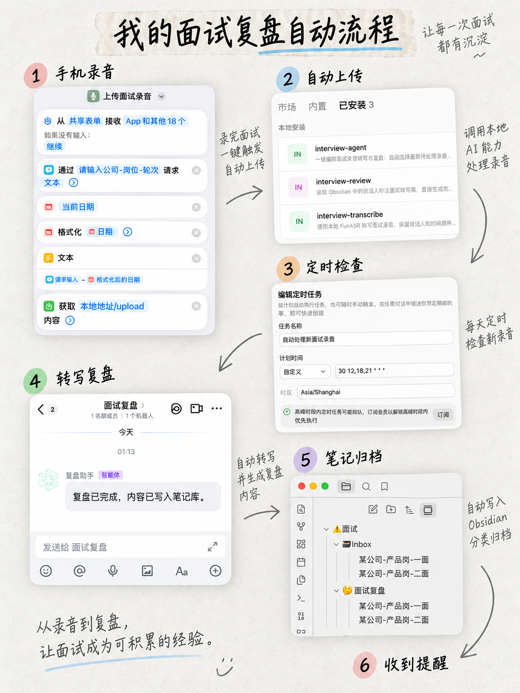

# Interview Review Agent

一套可迁移的面试录音自动转写与复盘工作流。它把手机录音、本地 FunASR、AI 复盘、Obsidian 归档和可选的群聊提醒串成一条可恢复、不会覆盖已有文件的流程。



## 为什么做这个项目

- **控制转写成本**：录音由本机 FunASR 处理，适合反复使用和较长音频。
- **沉淀个人知识库**：复盘以 Markdown 保存，可在 Obsidian 中搜索、修改和长期积累。
- **减少拖延造成的信息损失**：定时检查新录音，尽量在记忆仍清晰时生成第一版复盘。
- **及时核对 AI 判断**：完成后发送简短摘要，方便把 AI 关注点与自己的现场记忆对照，并继续补充复盘。

AI 不替代人的判断。它先完成最容易因忙碌或拖延而被放弃的整理工作，最终复盘仍由使用者核对和修正。

## 工作流

```text
手机录音
  -> 上传到 Mac
  -> 定时任务发现新文件
  -> 本地 FunASR 转写
  -> AI 直接生成 Markdown 复盘
  -> 写入 Obsidian
  -> 可选：发送群聊摘要
```

## 仓库内容

```text
skills/
  interview-transcribe/  选择录音并调用本地 FunASR
  interview-review/      读取逐字稿并生成 Markdown 复盘
  interview-agent/       编排完整流程并发送可选通知
scripts/
  1_transcribe.py        可直接改造的本地 FunASR 转写脚本
  privacy_scan.py        发布前隐私检查
examples/                完全虚构的输入与输出示例
docs/                    架构、安装和隐私说明
assets/                  匿名化流程示意图
```

## 快速开始

1. 安装本地依赖：`python3 -m pip install -r requirements.txt`。
2. 复制配置模板：`cp .env.example .env`。
3. 设置录音目录、Obsidian Vault、Inbox、复盘目录和本地转写脚本位置。
4. 在终端或 AI 工作台中加载这些环境变量；项目本身不会自动读取 `.env`。
5. 将 `skills/` 下需要的 Skill 安装到支持 Skill 的 AI 工作台。
6. 验证 `scripts/1_transcribe.py` 能接受音频路径、输出带说话人标签的文本。
7. 可选：配置飞书/Lark CLI 和目标群环境变量。

本仓库不包含 FunASR 模型和个人热词表。`scripts/1_transcribe.py` 是从实际工作流整理出的脱敏通用版本；你可以直接使用，也可以通过 `INTERVIEW_TRANSCRIBE_SCRIPT` 接入自己已验证的脚本。

详细说明见 [安装与配置](docs/setup.md) 和 [架构说明](docs/architecture.md)。

## 隐私与安全

公开仓库不得包含真实录音、逐字稿、复盘、公司信息、姓名、私有路径、IP 地址、群 ID 或密钥。提交前运行：

```bash
python3 scripts/privacy_scan.py .
```

不需要真实录音的基础测试：

```bash
python3 -m unittest discover -s tests
```

## 可替换组件

- AI 工作台可以替换，只要能读取 Skill、访问本地文件并调用脚本。
- Obsidian 只是 Markdown 的管理界面，可替换为其他本地知识库。
- 飞书通知是可选适配器，也可替换为其他消息渠道。
- 复盘阶段直接输出 Markdown，不使用中间 JSON。

## License

[MIT](LICENSE)
